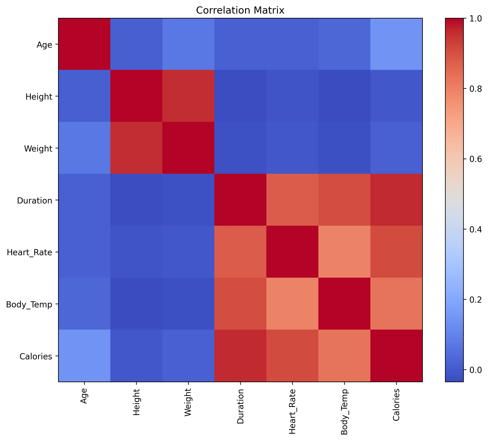
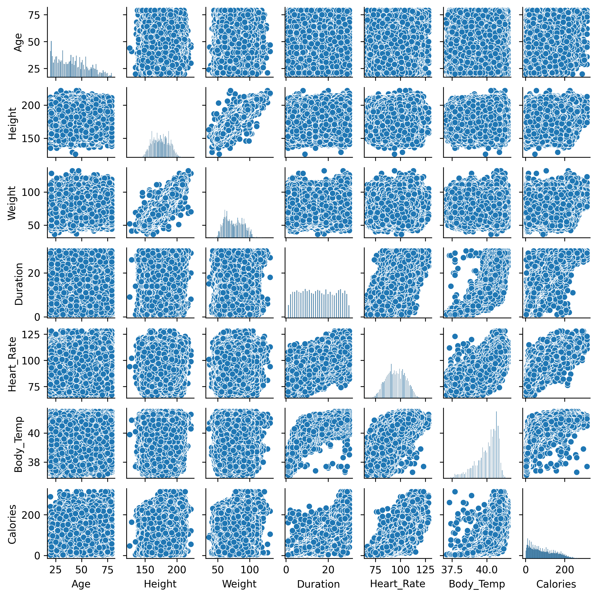
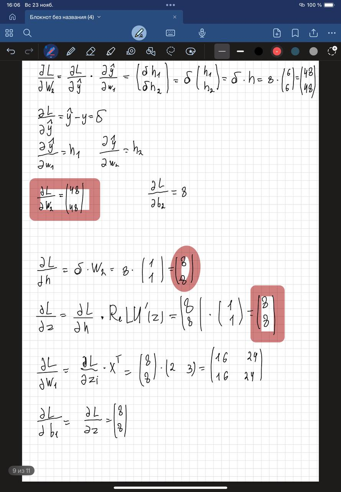
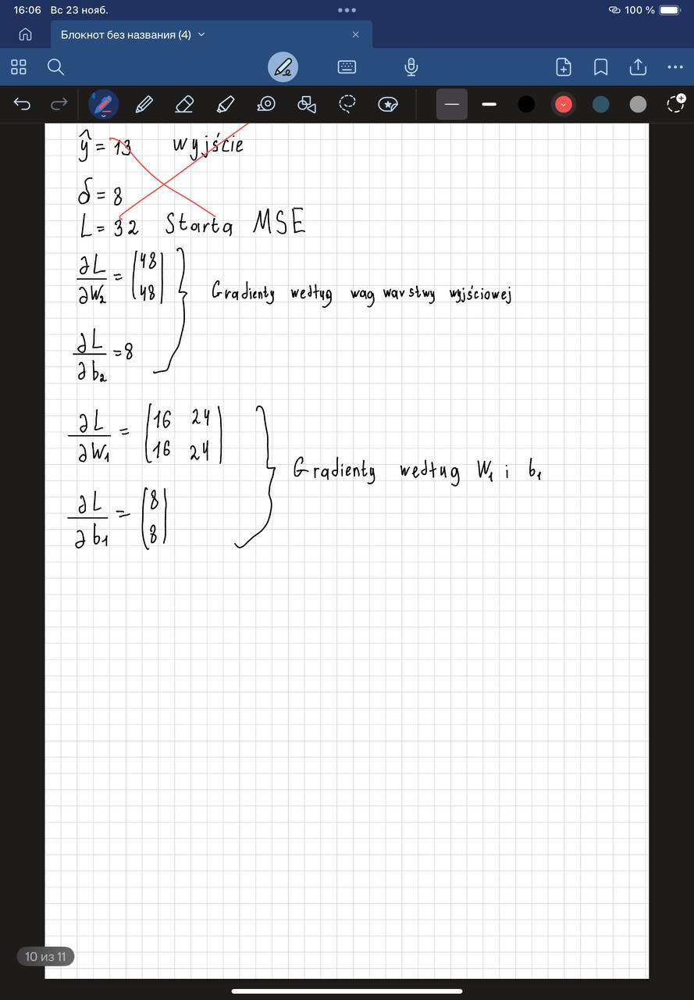
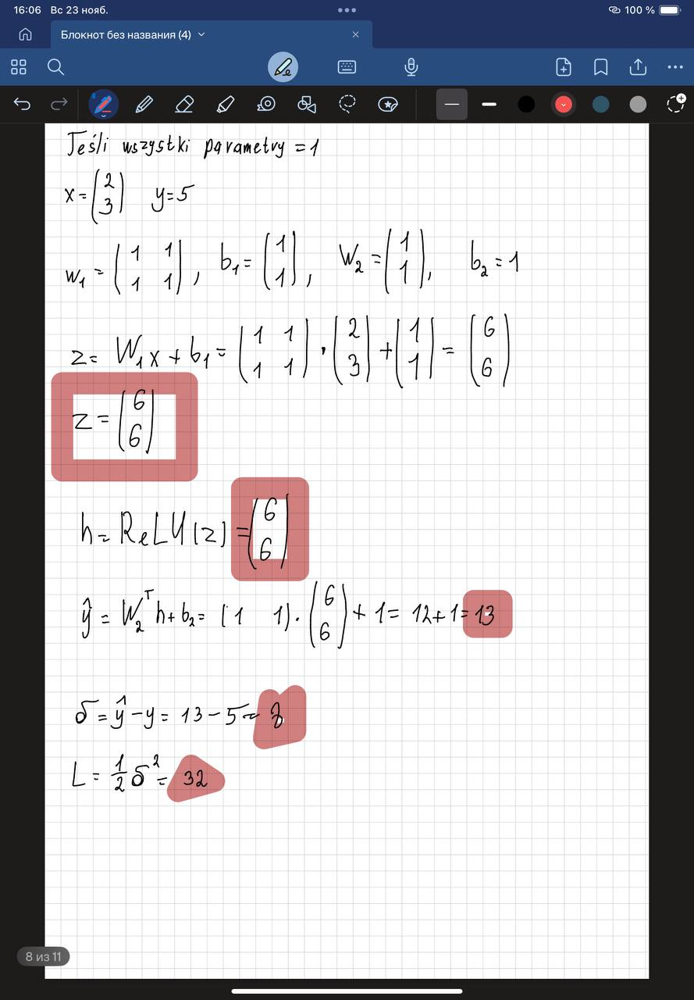

# Prognozowanie spalania kalorii

Prosty model feed-forward w PyTorch na konkurs Kaggle Playground S5E5. Kod trenuje na `train.csv`, porownuje hiperparametry, generuje wykresy EDA i przygotowuje predykcje w formacie konkursu.

## Model i trening
- Architektura: `Dropout(p=0.4) -> Linear(7,8) -> ReLU -> Linear(8,4) -> ReLU -> Linear(4,1)`, optymalizator SGD + momentum, funkcja straty RMSLE.
- Podzial: 80/20 train/val przez `torch.utils.data.random_split`.
- Dropout vs brak dropout: przy `p=0.4` model jest odporniejszy na szum i mniej sie przeucza; bez dropout szybciej schodzi na zbiorze treningowym, ale walidacja pogarsza sie wczesniej. Wylaczaj tylko przy bardzo czystych/malych danych.
- Wnioski z porownania (30 epok): najlepsze lr `0.001`, momentum `0.5` (RMSLE ~0.10, train/val spojne). lr `0.001` i momentum `0.3` bardzo blisko (~0.11). lr `0.0005` za wolne na 30 epok (>=0.13), lr `0.0001` nie schodzi (~0.78). Brak oznak overfittingu; dropout 0.4 stabilizuje trening.

## Instalacja srodowiska
```bash
git clone <repo_url>
cd Calorie-Expenditure-Prediction
pip install uv              # https://docs.astral.sh/uv/getting-started/installation/#standalone-installer
uv sync
```

## Jak uruchamiac
- Trening jednej konfiguracji: `uv run python -m src.train`
- Siatka hiperparametrow: `uv run python -m src.compare`
- Mapa korelacji: `uv run python -m src.charts.corr` (zapisuje `visual/correlation_matrix.png`)
- Scatter/pairplot: `uv run python -m src.charts.scatter` (zapisuje `visual/scatter_plot.png`)
- Predykcja na tescie: `uv run python -m src.predict` (laduje wagi `outputs/2025-11-22/16-39-52/best_model.pth`)
- Testy jednostkowe: `uv run python -m pytest`

## EDA
- Korelacje: `visual/correlation_matrix.png`
- Scatter/pairplot: `visual/scatter_plot.png`




## Zadanie teoretyczne — obliczenia




## Zadanie teoretyczne (skrot)
1) Dropout: regularyzacja, losowo wylacza czesc neuronow w trakcie treningu, zmniejszajac przeuczenie. W inferencji wszystkie neurony dzialaja, wagi sa skalowane.
2) Funkcje aktywacji: dodaja nieliniowosc; bez nich wielowarstwowa siec redukuje sie do jednej transformacji liniowej i nie modeluje zlozonych zaleznosci.
3) Kiedy sieci: gdy relacje sa nieliniowe i trudne do opisania regulkami (prognozy, klasyfikacja, obraz, mowa). Zestaw if-ow nie uogolni przy ciaglych, szumnych danych.

### Przyklad obliczony recznie (architektura z zadania)
- Dane: `x = [2, 3]`, cel `y = 5`, wszystkie wagi/biasy = 1, ReLU w warstwie ukrytej, MSE.
- Forward: `z = W1*x + b1 = [6, 6]`, `h = ReLU(z) = [6, 6]`, `y_hat = W2^T h + b2 = 13`, blad `delta = 8`, strata `L = 32`.
- Gradienty: `dL/dW2 = [48, 48]^T`, `dL/db2 = 8`, `dL/dW1 = [[16, 24], [16, 24]]`, `dL/db1 = [8, 8]^T`, `dL/dz = [8, 8]`.


## Uwagi techniczne
- Konfiguracje treningu sa w `src/config`.
- Wykresy zapisywane sa do `visual/`.
